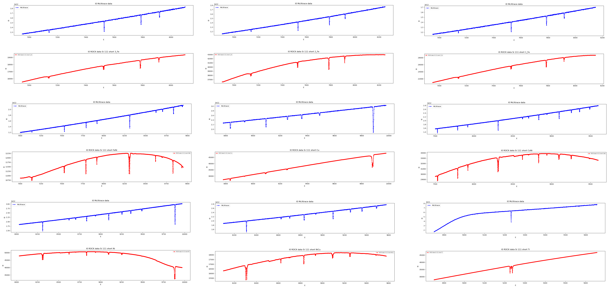
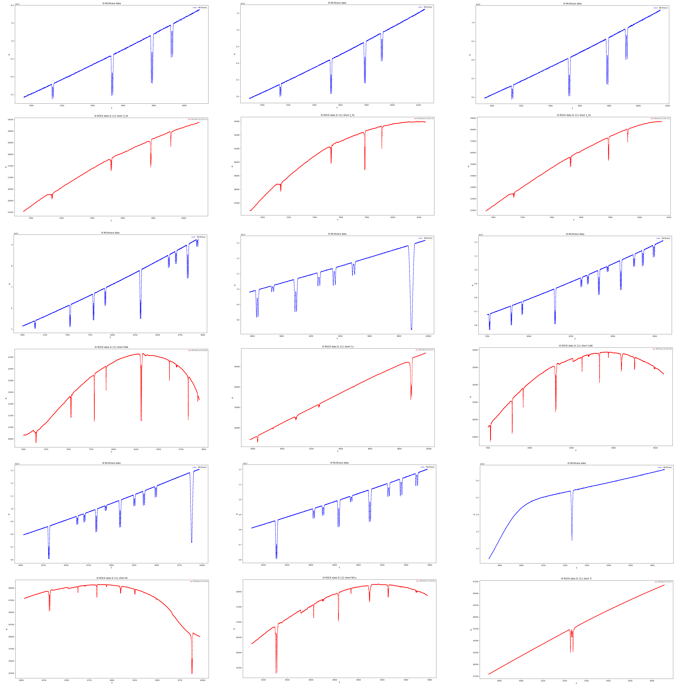

# Glitch runner stand alone version 

Glitch runner aims to recreate glitches found on synchrotron beamlines with the Monte Carlo ray tracing software McXtrace.  
This is the stand alone version of the Glitch runner. Jupyter notebooks also exist.  

As of now, SOLEIL's ROCK absorption beamline with the Si 111 short channel cut monochromator is taken as a choice for the stand alone version.  

The stand alone version is the most up to date.

# Results ROCK Si 111 short

# Results ROCK Si 111 short (bigger mosaic and lattice spacing variance)

Mosaic is set to 0.5 and delta_d_d is set to 1e-8.  

