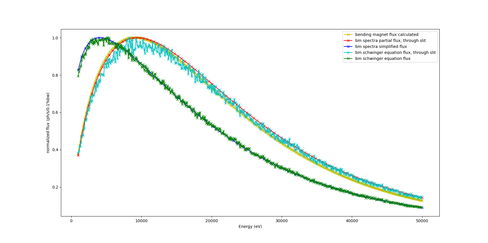

# Bending magnet flux

The flux is calculated with Schwinger's equation ([see equation 1 here](https://xdb.lbl.gov/Section2/Sec_2-1.html)) in the python script bm_mc_slit.py.  

The following graph shows the total flux and flux that passes through a slit when generating angles psi and theta over 2.5 mrad with the python script. They are compared to spectra's calculation of the total flux and flux that passes through a slit. The fluxes are also compared to another flux through a slit calculation.  

Work is still in progress and updates will be pushed here.
